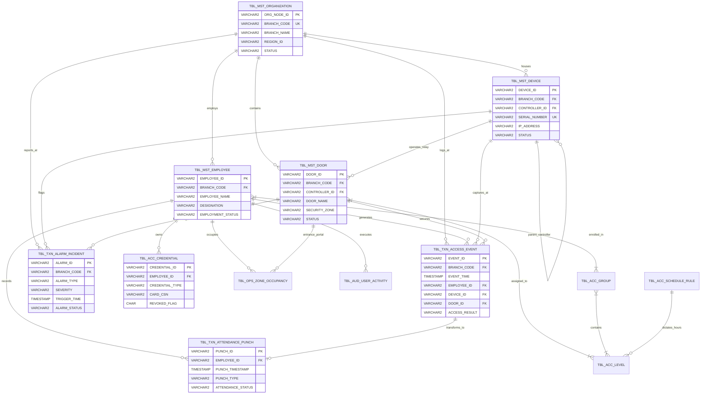

# Pubali Bank Physical Security Platform - Data Structure Specification
**Document ID:** PB-SEC-SPEC-2026-V1.0  
**Target Organization:** Pubali Bank PLC  
**Platform Scope:** Centralized Physical Access Control System (PACS), Biometric Time & Attendance (TA), and High-Security Banking Operations Dashboard  
**Architecture Baseline:** Suprema BioStar X ↔ Integration API Layer ↔ Pubali Bank Enterprise Core (Oracle DB) ↔ Central Security Dashboard  
**Classification:** STRICTLY CONFIDENTIAL - ENTERPRISE BANKING INTERNAL  
**Status:** RELEASED FOR INTEGRATION IMPLEMENTATION  

---

## EXECUTIVE SUMMARY & SYSTEM CONTEXT

This document provides the definitive data architecture, entity-relationship models, schema dictionaries, real-time messaging payloads, and integration contracts for deploying the **Enterprise Physical Security & Attendance Platform** across all **520+ Branches, 281+ Sub-Branches, 27 Regional Zones, and the Motijheel Principal Central Head Office of Pubali Bank PLC**.

### Architectural Topology

```
+-----------------------------------------------------------------------------------------+
|                              PHYSICAL SECURITY EDGE LAYER                               |
|   Suprema FaceStation F2 / BioStation 3 / XPass 2 / CoreStation Intelligent Controllers |
|       (Dual Biometric Face/Finger, DESFire EV2/EV3 Smart Cards, RS-485 OSDPv2)          |
+--------------------------------------------+--------------------------------------------+
                                             | TCP/IP (Encrypted TLS 1.3 / AES-256)
                                             v
+-----------------------------------------------------------------------------------------+
|                               SUPREMA BIOSTAR X PLATFORM                                |
|   Centralized Biometric Engine, Device Fleet Manager, Template Store, Real-Time Broker  |
+--------------------------------------------+--------------------------------------------+
                                             | REST Webhooks / SSE / WebSockets
                                             v
+-----------------------------------------------------------------------------------------+
|                                 INTEGRATION API LAYER                                   |
|   Reverse Proxy, mTLS Validator, Event Normalizer, Stream Processor & Kafka/MQ Pipeline |
+----------------------+------------------------------------+-----------------------------+
                       |                                    |
                       | JDBC / Oracle OCI Pool             | WebSocket Streaming (JSON)
                       v                                    v
+--------------------------------------+   +----------------------------------------------+
|     PUBALI BANK EXISTING SYSTEMS     |   |          BANK SECURITY DASHBOARD             |
|       (Enterprise Oracle 19c/21c)    |   |           (SOC Operations Portal)            |
|   - HR & Payroll Core Master         |   | - 24/7 Nationwide Live Monitoring            |
|   - Branch Banking Master Hierarchy  |   | - Who-Is-Inside Real-time Vault Tracking     |
|   - Audit & Compliance Vault         |   | - Remote Emergency Lockdown & Incident Desk  |
+--------------------------------------+   +----------------------------------------------+
```

---

## 1. SYSTEM DATA FLOW

### 1.1 Data Sources
1. **Edge Biometric Devices & Access Controllers:** Suprema BioStar 2/X hardware fleet deployed across bank branch entrances, cash processing areas, vault ante-rooms, server racks, and branch manager cabins.
2. **Suprema BioStar X Management Server:** Core system running the Suprema Device SDK, Biometric Template Database, and Event Broker service.
3. **Pubali Bank Enterprise Oracle Database:** Source of Truth (SoT) for active staff records, employee transfers, branch corporate structure, leave applications, and banking operational shifts.
4. **Security Operations Center (SOC) Console:** Interactive operator inputs including alarm acknowledgments, manual gate pulses, security escalation tickets, and muster clearing.

### 1.2 Data Collection Methods
* **Real-time Event Streaming:** BioStar X utilizes HTTP/2 Server-Sent Events (SSE) and persistent WebSockets to dispatch access grant/deny and biometric verification telemetry within 250 milliseconds of physical badge/face interaction.
* **Asynchronous Webhook Notifications:** Critical life-safety alarms (Door Forced Open, Door Held Open, Controller Tamper, Duress Punch, Fire Break-Glass) invoke automated HTTPS POST webhooks directly to the Integration API Layer.
* **Bulk Master Data Reconciliation (Scheduled ETL):** Batch synchronization jobs executed every 60 minutes query Pubali Bank's Core HR Oracle tables (`HR_EMPLOYEES_PUBALI`, `BRANCH_ORGANIZATION_PUBALI`) to propagate employee transfers, joiners, terminations, and suspension states.
* **Bi-directional Device Heartbeat Polling:** Periodic 30-second ping/heartbeat checks collect hardware state, IP reachability, lock status, and memory buffer depth from each edge terminal.

### 1.3 Data Synchronization Flow

```
[Pubali Bank HR (Oracle)]
       |
       | 1. Hourly Delta Sync (Joiners, Leavers, Branch Transfers)
       v
[Integration Service] -------------------------------------+
       |                                                   |
       | 2. Provision User & Assign Access Groups          |
       v                                                   |
[Suprema BioStar X Engine]                                 |
       |                                                   |
       | 3. Distribute Credentials to Edge Devices         |
       v                                                   |
[Terminal / FaceStation]                                   |
       |                                                   |
       | 4. User Authenticates (Face / Card / Finger)      |
       v                                                   |
[Terminal / FaceStation]                                   |
       |                                                   |
       | 5. Event Captured Locally -> Sent to BioStar X    |
       v                                                   |
[Suprema BioStar X Engine]                                 |
       |                                                   |
       | 6. SSE Stream / Webhook Dispatched                |
       v                                                   |
[Integration API Layer] <----------------------------------+
       |
       +------------+-----------------------------+
       |                                          |
       | 7. Persist Transaction & Audit           | 8. Emit Real-time Socket Event
       v                                          v
[Pubali Bank Security Tables (Oracle)]    [Bank Security Dashboard (Web)]
```

### 1.4 API Communication Protocol & Security
* **Network Encryption:** Transport Layer Security (TLS 1.3) with forced AES-GCM-256 cipher suites.
* **Mutual Authentication:** mTLS (client and server x509 certificates) for all server-to-server traffic between BioStar X, the Integration API Gateway, and the Bank Internal App Tier.
* **API Authentication:** JSON Web Tokens (JWT) signed using RS256 with 15-minute expiration windows for dashboard sessions, and rotating API keys stored in Hardware Security Modules (HSM) for backend daemons.
* **Resilience & Fault Tolerance:** In the event of wide-area network (WAN) partition between a branch and the central data center, Suprema edge controllers buffer up to 1,000,000 offline event logs. Upon link restoration, the Integration Engine performs gap reconciliation with deduplication based on `(DEVICE_ID, EVENT_TIMESTAMP, SEQUENCE_NO)`.

### 1.5 Data Storage Responsibilities
| System Layer | Primary Storage Role | Retention Period | High Availability / SLA |
| :--- | :--- | :--- | :--- |
| **Suprema BioStar X** | Device configurations, encrypted biometric templates (ISO 19794-2/4 & proprietary ANSI-378), active firmware binaries, raw edge telemetry buffer. | 90 Days Rolling Buffer | Active-Passive Clustering (RTO < 5 min, RPO < 1 min) |
| **Pubali Bank Oracle DB** | Canonical Enterprise Master Data, Historical Access Logs, Attendance Compliance, Security Incidents, Privileged Operator Audit Trails. | 7 Years (Regulatory Bank Requirement) | Oracle Data Guard (Maximum Protection / Zero Data Loss) |
| **Integration Layer Cache** | In-Memory Redis cluster for transient connection state, Who-Is-Inside occupancy caches, active alarms, and WebSocket subscription tables. | Transient / 24 Hours | Redis Sentinel / Cluster Multi-AZ |
| **Edge Hardware Memory** | Local offline whitelist, access schedule tables, and local flash transaction log buffer. | 1,000,000 Offline Events | Non-volatile flash memory with supercap power backup |

---

## 2. MASTER DATA STRUCTURE

All entities are engineered to comply with enterprise Oracle Database naming conventions, strict referential integrity constraints, and audited data types.

### 2.1 Organization Master (`TBL_MST_ORGANIZATION`)
Represents the hierarchical operational branch structure of Pubali Bank PLC.

| Column Name | Data Type | Nullable | PK / FK | Description | Validation / Constraints | Source System |
| :--- | :--- | :---: | :---: | :--- | :--- | :--- |
| `ORG_NODE_ID` | `VARCHAR2(36)` | NO | PK | Unique UUID identifier for organization node | UUIDv4 format | Bank Oracle DB |
| `BANK_ID` | `VARCHAR2(10)` | NO | - | Institutional identifier | Value: `'PUBALI'` | Static / ERP |
| `REGION_ID` | `VARCHAR2(20)` | NO | - | Regional zone code (e.g. `'REG-DHK-NORTH'`) | Must exist in Regional Zones | Bank Oracle DB |
| `REGION_NAME` | `VARCHAR2(100)` | NO | - | Human readable name of the Regional Zone | e.g. `'Dhaka North Region'` | Bank Oracle DB |
| `BRANCH_ID` | `VARCHAR2(20)` | NO | UK | Unique Branch ID / Routing identifier | Format: `'BR-' + 4 digits` | Bank Oracle DB |
| `SUB_BRANCH_ID` | `VARCHAR2(20)` | YES | - | Identifier if node represents a Feeder Sub-Branch | Nullable for main branches | Bank Oracle DB |
| `BRANCH_NAME` | `VARCHAR2(120)` | NO | - | Official branch title registered with Bangladesh Bank | e.g. `'Dhanmondi Branch'` | Bank Oracle DB |
| `BRANCH_CODE` | `VARCHAR2(10)` | NO | UK | Official Core Banking System (CBS) branch code | 4-5 numeric characters | Core Banking (CBS) |
| `DIVISION` | `VARCHAR2(50)` | NO | - | Administrative division of Bangladesh | Dhaka, Chittagong, Sylhet, etc. | Bank Oracle DB |
| `DISTRICT` | `VARCHAR2(50)` | NO | - | District location | e.g. `'Dhaka'`, `'Comilla'` | Bank Oracle DB |
| `ADDRESS` | `VARCHAR2(300)` | NO | - | Complete postal and physical site address | Street, Building, Floor details | Bank Oracle DB |
| `GEO_LATITUDE` | `NUMBER(10,7)` | YES | - | GPS latitude coordinate for mapping | Between 20.0000000 and 27.0000000 | Branch Inventory |
| `GEO_LONGITUDE` | `NUMBER(10,7)` | YES | - | GPS longitude coordinate for mapping | Between 88.0000000 and 93.0000000 | Branch Inventory |
| `SECURITY_TIER` | `VARCHAR2(20)` | NO | - | Physical security criticality level | `TIER_1_HQ`, `TIER_2_CURRENCY_CHEST`, `TIER_3_URBAN`, `TIER_4_RURAL` | Security Dept |
| `STATUS` | `VARCHAR2(20)` | NO | - | Operational state | `'ACTIVE'`, `'INACTIVE'`, `'RELOCATING'`, `'MAINTENANCE'` | Bank Oracle DB |
| `CREATED_AT` | `TIMESTAMP(6) WITH TIME ZONE` | NO | - | Record inception timestamp | Default `SYSTIMESTAMP` | System |
| `UPDATED_AT` | `TIMESTAMP(6) WITH TIME ZONE` | NO | - | Record last modification timestamp | Updated via Trigger | System |

### 2.2 Employee Master (`TBL_MST_EMPLOYEE`)
Maintains biometric identities, organizational affiliations, and HR statuses of all credentialed bank personnel.

| Column Name | Data Type | Nullable | PK / FK | Description | Validation / Constraints | Source System |
| :--- | :--- | :---: | :---: | :--- | :--- | :--- |
| `EMPLOYEE_ID` | `VARCHAR2(20)` | NO | PK | Official Pubali Bank Employee Code | 6-8 Alphanumeric string | Pubali Bank HR Oracle |
| `FIRST_NAME` | `VARCHAR2(60)` | NO | - | Employee first name | Alphabetic characters | Pubali Bank HR Oracle |
| `LAST_NAME` | `VARCHAR2(60)` | NO | - | Employee surname / family name | Alphabetic characters | Pubali Bank HR Oracle |
| `EMPLOYEE_NAME` | `VARCHAR2(150)` | NO | - | Full official name as registered on National ID | Standardized Uppercase | Pubali Bank HR Oracle |
| `DEPARTMENT` | `VARCHAR2(80)` | NO | - | Functional operational department | e.g. `'General Banking'`, `'Cash Operations'`, `'IT Infrastructure'` | Pubali Bank HR Oracle |
| `DESIGNATION` | `VARCHAR2(80)` | NO | - | Corporate organizational title | e.g. `'Principal Officer'`, `'Senior Vice President'` | Pubali Bank HR Oracle |
| `BRANCH_CODE` | `VARCHAR2(10)` | NO | FK | Assigned primary operational branch | References `TBL_MST_ORGANIZATION.BRANCH_CODE` | Pubali Bank HR Oracle |
| `REGION_ID` | `VARCHAR2(20)` | NO | - | Administrative region code | Matches Branch Region | Pubali Bank HR Oracle |
| `EMPLOYMENT_STATUS` | `VARCHAR2(20)` | NO | - | Current HR employment status | `'ACTIVE'`, `'ON_LEAVE'`, `'SUSPENDED'`, `'RESIGNED'`, `'TERMINATED'` | Pubali Bank HR Oracle |
| `PRIMARY_CARD_ID` | `VARCHAR2(50)` | YES | UK | RFID Smart Card CSN / Hexadecimal Serial | 8 to 16 character hex string | Suprema BioStar X |
| `SECONDARY_CARD_ID` | `VARCHAR2(50)` | YES | - | Backup or emergency smart card identifier | Nullable | Suprema BioStar X |
| `FACE_ENROLLED` | `CHAR(1)` | NO | - | Biometric facial template enrollment indicator | `'Y'` or `'N'` | Suprema BioStar X |
| `FINGER_ENROLLED` | `CHAR(1)` | NO | - | Biometric fingerprint enrollment indicator | `'Y'` or `'N'` | Suprema BioStar X |
| `MOBILE_CREDENTIAL_ENROLLED` | `CHAR(1)` | NO | - | BLE/NFC mobile card token enrollment status | `'Y'` or `'N'` | Suprema BioStar X |
| `BIOMETRIC_TEMPLATE_ID` | `VARCHAR2(64)` | YES | - | BioStar X internal reference GUID for biometric templates | Foreign reference to BioStar Store | Suprema BioStar X |
| `SECURITY_CLEARANCE` | `VARCHAR2(20)` | NO | - | Bank security access tier | `'EXECUTIVE'`, `'VAULT_OFFICER'`, `'CASH_TELLER'`, `'IT_STAFF'`, `'GENERAL_STAFF'` | Bank Security Dept |
| `NATIONAL_ID_NO` | `VARCHAR2(30)` | NO | - | Official 10 or 17 digit Bangladesh NID | Encrypted at Rest (AES-256) | Pubali Bank HR Oracle |
| `PHONE_NUMBER` | `VARCHAR2(20)` | YES | - | Official mobile number for SMS OTP alerts | E.164 Format: `+8801XXXXXXXXX` | Pubali Bank HR Oracle |
| `OFFICIAL_EMAIL` | `VARCHAR2(100)` | YES | - | Official corporate email | `@pubalibankbd.com` format | Pubali Bank HR Oracle |
| `EFFECTIVE_FROM` | `DATE` | NO | - | Date identity becomes active for access | Valid Date | Pubali Bank HR Oracle |
| `EXPIRATION_DATE` | `DATE` | YES | - | Scheduled access de-provisioning date | Nullable for permanent staff | Pubali Bank HR Oracle |
| `UPDATED_AT` | `TIMESTAMP(6) WITH TIME ZONE` | NO | - | Audit synchronization timestamp | System Timestamp | System |

### 2.3 Device Master (`TBL_MST_DEVICE`)
Inventory of all Suprema biometric readers, slave peripherals, and intelligent distributed controllers.

| Column Name | Data Type | Nullable | PK / FK | Description | Validation / Constraints | Source System |
| :--- | :--- | :---: | :---: | :--- | :--- | :--- |
| `DEVICE_ID` | `VARCHAR2(32)` | NO | PK | Unique Hardware Device Identifier in BioStar X | Alphanumeric or Integer String | Suprema BioStar X |
| `DEVICE_NAME` | `VARCHAR2(100)` | NO | - | Descriptive alias for hardware node | e.g. `'Dhanmondi-Vault-Entrance-F2'` | BioStar X / Admin |
| `DEVICE_TYPE` | `VARCHAR2(40)` | NO | - | Hardware category | `'FACE_TERMINAL'`, `'FINGERPRINT_READER'`, `'CONTROLLER'`, `'SLAVE_READER'` | BioStar X |
| `MODEL` | `VARCHAR2(50)` | NO | - | Suprema hardware model name | `'FaceStation F2'`, `'BioStation 3'`, `'CoreStation CS-40'`, `'XPass 2'` | BioStar X |
| `SERIAL_NUMBER` | `VARCHAR2(50)` | NO | UK | Factory engraved hardware serial number | Alphanumeric String | BioStar X |
| `MAC_ADDRESS` | `VARCHAR2(17)` | NO | UK | Hardware physical network MAC address | Format: `'XX:XX:XX:XX:XX:XX'` | BioStar X |
| `IP_ADDRESS` | `VARCHAR2(45)` | NO | - | Static local or corporate WAN IPv4/IPv6 address | Valid IPv4/IPv6 address | Network Engineering |
| `SUBNET_MASK` | `VARCHAR2(15)` | YES | - | Local network subnet mask | e.g. `'255.255.255.0'` | Network Engineering |
| `GATEWAY` | `VARCHAR2(45)` | YES | - | Branch router default gateway | Valid IP | Network Engineering |
| `PORT` | `NUMBER(5)` | NO | - | Direct communication TCP port | Default: `51211` or `51212` | BioStar X |
| `PHYSICAL_LOCATION` | `VARCHAR2(150)` | NO | - | Precise physical installation location within branch | e.g. `'Ground Floor Cash Counter Air-Lock'` | Installation Survey |
| `BRANCH_CODE` | `VARCHAR2(10)` | NO | FK | Branch location where device is deployed | References `TBL_MST_ORGANIZATION.BRANCH_CODE` | Bank Inventory |
| `CONTROLLER_ID` | `VARCHAR2(32)` | YES | FK | Upstream CoreStation controller ID if RS-485 slave | Self-references `TBL_MST_DEVICE.DEVICE_ID` | BioStar X |
| `RS485_CHANNEL_INDEX` | `NUMBER(2)` | YES | - | Controller RS-485 port index | Range: `0` to `4` | BioStar X |
| `FIRMWARE_VERSION` | `VARCHAR2(30)` | NO | - | Active software firmware compilation build | e.g. `'v2.9.4.12_BUILD2026'` | BioStar X |
| `STATUS` | `VARCHAR2(20)` | NO | - | Real-time connectivity state | `'ONLINE'`, `'OFFLINE'`, `'TAMPERED'`, `'FAULT'`, `'MAINTENANCE'` | BioStar X Telemetry |
| `LAST_SYNC_TIME` | `TIMESTAMP(6) WITH TIME ZONE` | YES | - | Timestamp of most recent successful config push | System Timestamp | BioStar X |
| `LAST_HEARTBEAT_TIME` | `TIMESTAMP(6) WITH TIME ZONE` | YES | - | Timestamp of most recent keep-alive ping | System Timestamp | BioStar X |
| `INSTALLATION_DATE` | `DATE` | NO | - | Commercial commissioning sign-off date | Valid Date | Dealer Records |
| `WARRANTY_EXPIRATION` | `DATE` | NO | - | Vendor hardware SLA / warranty expiration date | Valid Date | Dealer Records |

### 2.4 Door Master (`TBL_MST_DOOR`)
Physical access barriers, security zoning, interlocks, and hardware peripherals.

| Column Name | Data Type | Nullable | PK / FK | Description | Validation / Constraints | Source System |
| :--- | :--- | :---: | :---: | :--- | :--- | :--- |
| `DOOR_ID` | `VARCHAR2(32)` | NO | PK | Unique Door identifier | Form: `'DR-' + 6 digits` | BioStar X |
| `DOOR_NAME` | `VARCHAR2(100)` | NO | - | Descriptive identifier of physical door | e.g. `'Principal Cash Vault Outer Steel Door'` | BioStar X / Admin |
| `BRANCH_CODE` | `VARCHAR2(10)` | NO | FK | Associated bank branch | References `TBL_MST_ORGANIZATION.BRANCH_CODE` | Bank Inventory |
| `SECURITY_ZONE` | `VARCHAR2(40)` | NO | - | Functional operational security zone | `'MAIN_ENTRANCE'`, `'TELLER_COUNTER'`, `'ATM_SERVICE_ROOM'`, `'CASH_VAULT'`, `'SERVER_ROOM'`, `'MANAGER_OFFICE'` | Security Policy |
| `SECURITY_CLASSIFICATION` | `VARCHAR2(20)` | NO | - | Risk severity rating of the portal | `'CRITICAL_VAULT'`, `'HIGH_SERVER'`, `'MEDIUM_CASH'`, `'STANDARD_OFFICE'` | Security Policy |
| `CONTROLLER_ID` | `VARCHAR2(32)` | NO | FK | Controlling CoreStation / Intelligent Terminal | References `TBL_MST_DEVICE.DEVICE_ID` | BioStar X |
| `ENTRY_READER_ID` | `VARCHAR2(32)` | NO | FK | Authentication hardware mounted on outside | References `TBL_MST_DEVICE.DEVICE_ID` | BioStar X |
| `EXIT_READER_ID` | `VARCHAR2(32)` | YES | FK | Authentication hardware mounted on inside | Null if Request-to-Exit (REX) button used | BioStar X |
| `LOCK_TYPE` | `VARCHAR2(30)` | NO | - | Electromechanical hardware type | `'ELECTROMAGNETIC_600LBS'`, `'DROP_BOLT'`, `'MOTORIZED_MORTISE'`, `'SHEAR_LOCK'` | Installation Spec |
| `RELAY_INDEX` | `NUMBER(2)` | NO | - | Physical output relay channel on controller | Range: `0` to `7` | BioStar X |
| `DOOR_SENSOR_TYPE` | `VARCHAR2(30)` | NO | - | State monitoring contact sensor | `'MAGNETIC_REED_CONTACT'`, `'PLUNGER_SWITCH'`, `'NONE'` | Installation Spec |
| `DOOR_SENSOR_INPUT_INDEX`| `NUMBER(2)` | YES | - | Physical auxiliary input port for sensor | Range: `0` to `7` | BioStar X |
| `REX_INPUT_INDEX` | `NUMBER(2)` | YES | - | Physical auxiliary input port for push-to-exit | Range: `0` to `7` | BioStar X |
| `AUTO_RELOCK_DELAY_SEC` | `NUMBER(3)` | NO | - | Seconds pulse energizes lock upon valid access | Range: `1` to `30` (Default: `5`) | Security Policy |
| `HELD_OPEN_WARN_TIME_SEC`| `NUMBER(4)` | NO | - | Duration door can remain open before alarm | Range: `5` to `300` (Default: `30`) | Security Policy |
| `INTERLOCK_GROUP_ID` | `VARCHAR2(32)` | YES | - | ID of two-door mantrap air-lock cluster | Linked doors cannot open simultaneously | Security Policy |
| `DUAL_AUTH_REQUIRED` | `CHAR(1)` | NO | - | Flag indicating 2-Man Rule required for entry | `'Y'` or `'N'` (Default `'Y'` for Vaults) | Security Policy |
| `STATUS` | `VARCHAR2(20)` | NO | - | Current physical operational state | `'LOCKED'`, `'UNLOCKED'`, `'HELD_OPEN'`, `'FORCED_OPEN'`, `'LOCKDOWN'` | BioStar X Telemetry |

---

## 3. TRANSACTION DATA STRUCTURE

Transaction entities handle high-velocity write throughput and are optimized with monthly table partitioning in Oracle.

### 3.1 Access Event Data (`TBL_TXN_ACCESS_EVENT`)
High-volume physical security logs generated upon every credential swipe, face scan, or denied entry.

| Column Name | Data Type | Nullable | PK / FK | Description | Validation / Constraints | Source System |
| :--- | :--- | :---: | :---: | :--- | :--- | :--- |
| `EVENT_ID` | `VARCHAR2(40)` | NO | PK | Unique Event UUID or Sequence | Primary Key | BioStar X Engine |
| `BRANCH_CODE` | `VARCHAR2(10)` | NO | FK | Branch location where event occurred | Partition Key Component | BioStar X Engine |
| `EVENT_TIME` | `TIMESTAMP(6) WITH TIME ZONE` | NO | - | Millisecond-accurate timestamp of event | Partition Key Component | Edge Device RTC |
| `SERVER_RECEIVED_TIME` | `TIMESTAMP(6) WITH TIME ZONE` | NO | - | Timestamp when BioStar X received event | Latency tracking | BioStar X Engine |
| `EMPLOYEE_ID` | `VARCHAR2(20)` | YES | FK | Bank Employee ID (if recognized) | Nullable if unknown card | BioStar X / DB |
| `CARD_ID` | `VARCHAR2(50)` | YES | - | CSN or Wiegand string presented | Hexadecimal or integer string | Edge Reader |
| `DEVICE_ID` | `VARCHAR2(32)` | NO | FK | Physical device that processed credential | References `TBL_MST_DEVICE` | BioStar X Engine |
| `DOOR_ID` | `VARCHAR2(32)` | NO | FK | Associated door portal | References `TBL_MST_DOOR` | BioStar X Engine |
| `DIRECTION` | `VARCHAR2(10)` | NO | - | Passage vector | `'IN'`, `'OUT'`, `'UNKNOWN'` | BioStar X Engine |
| `AUTHENTICATION_METHOD` | `VARCHAR2(30)` | NO | - | Verification modality used | `'FACE'`, `'FINGERPRINT'`, `'CARD'`, `'CARD_PLUS_PIN'`, `'FACE_PLUS_CARD'`, `'REMOTE_PULSE'` | Edge Device |
| `ACCESS_RESULT` | `VARCHAR2(15)` | NO | - | Final authorization determination | `'GRANTED'`, `'DENIED'` | BioStar X Engine |
| `DENIAL_REASON` | `VARCHAR2(50)` | YES | - | Granular code if access denied | `'INVALID_CREDENTIAL'`, `'UNAUTHORIZED_DOOR'`, `'TIME_EXPIRED'`, `'OUT_OF_SCHEDULE'`, `'ANTI_PASSBACK_VIOLATION'`, `'INTERLOCK_BUSY'`, `'DUAL_AUTH_TIMEOUT'`, `'DEVICE_TAMPER_LOCKOUT'` | BioStar X Engine |
| `EVENT_TYPE` | `VARCHAR2(30)` | NO | - | Normalized BioStar event classification | `'NORMAL_VERIFY'`, `'DURESS_VERIFY'`, `'FORCED_OPEN'`, `'DOOR_HELD'`, `'EMERGENCY_RELEASE'` | BioStar X Engine |
| `BIOMETRIC_SCORE` | `NUMBER(3)` | YES | - | Machine learning match confidence | Range: `0` to `100` | Edge Biometric Engine |
| `MASK_DETECTED` | `CHAR(1)` | YES | - | Face terminal mask compliance flag | `'Y'`, `'N'`, `'N/A'` | FaceStation F2 |
| `TEMPERATURE_CELSIUS` | `NUMBER(4,1)` | YES | - | Thermal sensor reading (if equipped) | Range: `30.0` to `45.0` | Thermal Sensor |
| `SNAPSHOT_IMAGE_URL` | `VARCHAR2(255)` | YES | - | Secure HTTPS link to snapshot evidence | Encrypted URL | BioStar Object Store |

### 3.2 Attendance Punch Data (`TBL_TXN_ATTENDANCE_PUNCH`)
Sanitized and structured clock-in/out records feeding Pubali Bank's Central HRMS and Payroll engines.

| Column Name | Data Type | Nullable | PK / FK | Description | Validation / Constraints | Source System |
| :--- | :--- | :---: | :---: | :--- | :--- | :--- |
| `PUNCH_ID` | `VARCHAR2(40)` | NO | PK | Unique Attendance Punch Identifier | UUIDv4 format | Integration Layer |
| `EMPLOYEE_ID` | `VARCHAR2(20)` | NO | FK | Pubali Bank Employee ID | References `TBL_MST_EMPLOYEE` | Pubali Bank HR |
| `BRANCH_CODE` | `VARCHAR2(10)` | NO | FK | Branch location where employee punched | References `TBL_MST_ORGANIZATION` | BioStar X Engine |
| `PUNCH_TIMESTAMP` | `TIMESTAMP(6) WITH TIME ZONE` | NO | - | Exact time punch occurred | Local Timezone (`UTC+6`) | Edge Terminal |
| `PUNCH_DEVICE_ID` | `VARCHAR2(32)` | NO | FK | BioStar Terminal ID recorded | References `TBL_MST_DEVICE` | BioStar X Engine |
| `RAW_EVENT_ID` | `VARCHAR2(40)` | NO | FK | Traceability link to base access event | References `TBL_TXN_ACCESS_EVENT` | BioStar X Engine |
| `PUNCH_TYPE` | `VARCHAR2(20)` | NO | - | Directional attendance classification | `'CHECK_IN'`, `'CHECK_OUT'`, `'BREAK_OUT'`, `'BREAK_IN'`, `'OVERTIME_IN'`, `'OVERTIME_OUT'` | Integration Logic |
| `VERIFICATION_MODALITY` | `VARCHAR2(20)` | NO | - | Biometric mode used for attendance | `'FACE_BIOMETRIC'`, `'FINGERPRINT'`, `'SMART_CARD'` | Edge Terminal |
| `SCHEDULED_SHIFT_ID` | `VARCHAR2(20)` | YES | - | Expected working shift | e.g. `'BANK_STANDARD_09_17'` | HR Roster |
| `ATTENDANCE_STATUS` | `VARCHAR2(20)` | NO | - | Automated compliance status | `'ON_TIME'`, `'LATE_ARRIVAL'`, `'EARLY_DEPARTURE'`, `'GRACE_PERIOD'`, `'UNAUTHORIZED_LOCATION'` | Integration Logic |
| `LATE_MINUTES` | `NUMBER(4)` | YES | - | Minutes past scheduled shift start | Positive Integer or 0 | Calculated |
| `SYNC_STATUS_TO_ORACLE` | `VARCHAR2(20)` | NO | - | State of transmission to Core HRMS | `'PENDING'`, `'COMMITTED'`, `'FAILED'` | Integration Layer |
| `SYNC_TIMESTAMP` | `TIMESTAMP(6) WITH TIME ZONE` | YES | - | Timestamp pushed to HRMS | System Timestamp | Integration Layer |

### 3.3 Alarm & Incident Data (`TBL_TXN_ALARM_INCIDENT`)
Life-safety, breach, tamper, and duress events triggering priority visual/audio alerts on the SOC Dashboard.

| Column Name | Data Type | Nullable | PK / FK | Description | Validation / Constraints | Source System |
| :--- | :--- | :---: | :---: | :--- | :--- | :--- |
| `ALARM_ID` | `VARCHAR2(40)` | NO | PK | Unique Alarm Incident UUID | Primary Key | BioStar X / Integration |
| `BRANCH_CODE` | `VARCHAR2(10)` | NO | FK | Branch where security incident occurred | Partition Key | BioStar X Engine |
| `ALARM_TYPE` | `VARCHAR2(40)` | NO | - | Security incident classification code | `'DOOR_FORCED_OPEN'`, `'DOOR_HELD_OPEN_TIMEOUT'`, `'DEVICE_TAMPER'`, `'CONTROLLER_OFFLINE'`, `'DURESS_ALARM_SILENT'`, `'FIRE_PANIC_RELEASE'`, `'REPEATED_AUTH_FAIL'`, `'ANTI_PASSBACK_BREACH'`, `'MANTRAP_INTERLOCK_VIOLATION'` | BioStar X Engine |
| `SEVERITY` | `VARCHAR2(15)` | NO | - | Operational criticality rating | `'P1_CRITICAL'`, `'P2_HIGH'`, `'P3_MEDIUM'`, `'P4_LOW'` | Security Policy |
| `DEVICE_ID` | `VARCHAR2(32)` | YES | FK | Reporting device | References `TBL_MST_DEVICE` | BioStar X Engine |
| `DOOR_ID` | `VARCHAR2(32)` | YES | FK | Impacted door portal | References `TBL_MST_DOOR` | BioStar X Engine |
| `TRIGGER_TIME` | `TIMESTAMP(6) WITH TIME ZONE` | NO | - | Exact timestamp alarm was generated | Millisecond accuracy | Edge Device |
| `ALARM_STATUS` | `VARCHAR2(20)` | NO | - | Lifecycle progress of incident | `'NEW'`, `'ACKNOWLEDGED'`, `'INVESTIGATING'`, `'ESCALATED_TO_LAW_ENFORCEMENT'`, `'RESOLVED'`, `'FALSE_ALARM'` | SOC Operator |
| `ACKNOWLEDGED_BY` | `VARCHAR2(50)` | YES | - | User ID / Operator who accepted alert | Valid Bank User | SOC Dashboard |
| `ACKNOWLEDGED_TIME` | `TIMESTAMP(6) WITH TIME ZONE` | YES | - | Timestamp operator accepted alert | System Timestamp | SOC Dashboard |
| `RESOLUTION_NOTES` | `VARCHAR2(500)` | YES | - | Narrative report entered by SOC operator | Free text (Mandatory to resolve) | SOC Dashboard |
| `RESOLVED_BY` | `VARCHAR2(50)` | YES | - | User ID who closed the alarm ticket | Valid Bank User | SOC Dashboard |
| `RESOLUTION_TIME` | `TIMESTAMP(6) WITH TIME ZONE` | YES | - | Timestamp incident was finalized | System Timestamp | SOC Dashboard |
| `CCTV_PRESET_TAG` | `VARCHAR2(60)` | YES | - | Camera and PTZ preset tag for auto-cueing | e.g. `'CAM-BR0102-VAULT-DOOR-P1'` | VMS Integration |

---

## 4. SECURITY OPERATION DATA

Real-time banking physical security operations require specialized in-flight telemetry structures to enforce high-security standards.

### 4.1 Live Access Monitoring Cache (`TBL_OPS_LIVE_STREAM`)
Transient circular buffer holding the last 50 events per branch for zero-latency dashboard websocket streaming.

| Field Name | Data Type | Description | Source System |
| :--- | :--- | :--- | :--- |
| `STREAM_SEQ_ID` | `NUMBER(19)` | Sequential monotonic counter | Integration Engine |
| `BRANCH_CODE` | `VARCHAR2(10)` | Associated Bank Branch | BioStar X Engine |
| `EVENT_TIMESTAMP` | `TIMESTAMP(6)` | Real-time event timestamp | Edge Device |
| `ACTOR_NAME` | `VARCHAR2(150)` | Name of credential holder or `'UNKNOWN'` | HR Master / BioStar |
| `ACTOR_DESIGNATION`| `VARCHAR2(80)` | Role title of employee | HR Master |
| `PORTAL_NAME` | `VARCHAR2(100)` | Friendly door label | Door Master |
| `OUTCOME_CODE` | `VARCHAR2(10)` | `'GRANT'` or `'DENY'` | BioStar X Engine |
| `SECURITY_FLAG` | `VARCHAR2(20)` | `'NORMAL'`, `'RESTRICTED_AREA'`, `'AFTER_HOURS'`, `'DURESS'` | Integration Logic |

### 4.2 Who Is Inside (Zone Occupancy Tracker) (`TBL_OPS_ZONE_OCCUPANCY`)
Tracks active human presence inside protected banking compartments (particularly Currency Vaults, Safe Deposit Lockers, and Core Server Rooms).

| Field Name | Data Type | Description | Source System |
| :--- | :--- | :--- | :--- |
| `ZONE_INSTANCE_ID` | `VARCHAR2(40)` | Unique occupancy entry tracking token | Integration Engine |
| `BRANCH_CODE` | `VARCHAR2(10)` | Bank Branch identifier | Organization Master |
| `SECURITY_ZONE` | `VARCHAR2(40)` | `'CASH_VAULT'`, `'SERVER_ROOM'`, `'CASH_TELLER_CAGE'` | Door Master |
| `EMPLOYEE_ID` | `VARCHAR2(20)` | Employee currently detected inside | Access Event Stream |
| `ENTRY_TIME` | `TIMESTAMP(6)` | Timestamp employee entered zone | Access Event Stream |
| `ENTRY_DOOR_ID` | `VARCHAR2(32)` | Specific door utilized for ingress | Door Master |
| `DURATION_MINUTES` | `NUMBER(5)` | Dynamically calculated elapsed time inside | System Calculation |
| `LONE_WORKER_FLAG` | `CHAR(1)` | `'Y'` if single employee inside high-risk vault (Alert!) | Business Rule Engine |
| `TWO_MAN_PAIR_ID` | `VARCHAR2(20)` | Employee ID of second custodian (Dual Control) | Business Rule Engine |

### 4.3 Restricted Area Access & Multi-Person Rule (Dual Custody) (`TBL_OPS_DUAL_CUSTODY_SESSION`)
Enforces the mandatory commercial banking policy requiring two designated key-holders to present credentials within a 30-second window to unlock the Cash Vault.

| Field Name | Data Type | Description | Source System |
| :--- | :--- | :--- | :--- |
| `SESSION_ID` | `VARCHAR2(40)` | Unique dual authentication session UUID | Integration Engine |
| `DOOR_ID` | `VARCHAR2(32)` | Vault door receiving authentication requests | Door Master |
| `FIRST_OFFICER_ID` | `VARCHAR2(20)` | Employee ID of first custodian (e.g. Branch Manager) | BioStar X Engine |
| `FIRST_OFFICER_TIME`| `TIMESTAMP(6)` | Timestamp of first successful biometric scan | BioStar X Engine |
| `FIRST_OFFICER_AUTH`| `VARCHAR2(20)` | Authentication type (Face / Fingerprint) | BioStar X Engine |
| `SECOND_OFFICER_ID`| `VARCHAR2(20)` | Employee ID of second custodian (e.g. Vault Officer) | BioStar X Engine |
| `SECOND_OFFICER_TIME`| `TIMESTAMP(6)`| Timestamp of second biometric scan (within window) | BioStar X Engine |
| `SESSION_STATUS` | `VARCHAR2(20)` | `'WAITING_SECOND_OFFICER'`, `'COMPLETED_UNLOCKED'`, `'TIMED_OUT'`, `'UNAUTHORIZED_PAIR'` | Integration Engine |
| `TIMEOUT_DEADLINE` | `TIMESTAMP(6)` | Expiration timestamp (First Officer Time + 30 Seconds) | Integration Engine |

### 4.4 Anti-Passback (APB) State Tracking (`TBL_OPS_APB_STATE`)
Prevents credential sharing by tracking directional state (IN vs OUT) across secure perimeters.

| Field Name | Data Type | Description | Source System |
| :--- | :--- | :--- | :--- |
| `EMPLOYEE_ID` | `VARCHAR2(20)` | Employee credential identity (Primary Key) | Employee Master |
| `CURRENT_AREA_ID` | `VARCHAR2(32)` | Identifier of area employee is currently located | BioStar APB Engine |
| `LAST_EVENT_TIME` | `TIMESTAMP(6)` | Timestamp of last recorded directional badge scan | BioStar APB Engine |
| `LAST_DOOR_ID` | `VARCHAR2(32)` | Door utilized on previous access | Door Master |
| `LAST_DIRECTION` | `VARCHAR2(10)` | Direction recorded: `'IN'` or `'OUT'` | BioStar APB Engine |
| `APB_VIOLATION_COUNT`| `NUMBER(3)` | Running tally of passback violation attempts | BioStar APB Engine |
| `HARD_RESET_FLAG` | `CHAR(1)` | Manual override by security supervisor to clear state | SOC Dashboard |

### 4.5 Tailgating Detection & Unaccounted Presence (`TBL_OPS_TAILGATE_INCIDENT`)
Correlates optical beam / overhead stereo sensor trigger counts with badge swipe counts.

| Field Name | Data Type | Description | Source System |
| :--- | :--- | :--- | :--- |
| `INCIDENT_ID` | `VARCHAR2(40)` | Unique tailgating event tracking ID | Tailgate Sensor / VMS |
| `DOOR_ID` | `VARCHAR2(32)` | Monitored door portal | Door Master |
| `BRANCH_CODE` | `VARCHAR2(10)` | Associated Bank Branch | Organization Master |
| `DETECTION_TIME` | `TIMESTAMP(6)` | Time auxiliary sensor registered multiple passages | Sensor IO Board |
| `BADGE_COUNT` | `NUMBER(2)` | Number of authorized badges presented (e.g. `1`) | Access Event Stream |
| `PASSAGE_COUNT` | `NUMBER(2)` | Physical bodies detected traversing doorway (e.g. `2`) | Optical Sensor |
| `DISCREPANCY` | `NUMBER(2)` | Unaccounted individuals (`PASSAGE_COUNT - BADGE_COUNT`) | Integration Logic |
| `INVESTIGATION_STATUS`| `VARCHAR2(20)`| `'FLAGGED'`, `'DISMISSED'`, `'ESCALATED'` | SOC Operator |

### 4.6 Emergency Evacuation & Muster Roll (`TBL_OPS_MUSTER_EVACUATION`)
Maintains dynamic roll-call lists during fire, seismic, or armed incident emergencies.

| Field Name | Data Type | Description | Source System |
| :--- | :--- | :--- | :--- |
| `EMERGENCY_ID` | `VARCHAR2(40)` | Active emergency incident incident ID | SOC Dashboard / Fire Panel |
| `BRANCH_CODE` | `VARCHAR2(10)` | Branch undergoing evacuation | Organization Master |
| `DECLARATION_TIME` | `TIMESTAMP(6)` | Time emergency lockdown or release was tripped | System Trigger |
| `TRIGGER_SOURCE` | `VARCHAR2(30)` | `'FIRE_ALARM_PANEL'`, `'MANUAL_BREAK_GLASS'`, `'SOC_REMOTE_CMD'` | Alarm System |
| `TOTAL_OCCUPANTS_AT_TRIGGER`| `NUMBER(5)` | Snapshot count of all staff inside prior to event | Zone Occupancy Engine |
| `TOTAL_ACCOUNTED_AT_MUSTER` | `NUMBER(5)` | Count of staff scanned at external Safe Assembly Reader | BioStar Muster Terminal |
| `MISSING_PERSONS_COUNT` | `NUMBER(5)` | Occupants inside who have not reached muster point | Calculated Field |
| `OVERRIDE_DOOR_STATE` | `VARCHAR2(20)`| `'ALL_DOORS_UNLOCKED_FAILSAFE'`, `'VAULT_SECURED_FAIL_SECURE'` | Hardware Relay Logic |

---

## 5. ACCESS CONTROL DATA

Defines authorization policies, schedules, tiers, and administrative clearances.

### 5.1 Access Control Schema Dictionary

#### 5.1.1 Access Group (`TBL_ACC_GROUP`)
Logical collection linking User Groups to Access Levels.
* **`ACCESS_GROUP_ID`** (`VARCHAR2(32)`, PK): Unique identifier in BioStar X. *Source: BioStar X.*
* **`ACCESS_GROUP_NAME`** (`VARCHAR2(100)`, Mandatory): Name of group (e.g. `'Pubali-General-Branch-Staff'`). *Source: Bank Policy.*
* **`DESCRIPTION`** (`VARCHAR2(255)`, Optional): Functional scope of access group. *Source: Bank Policy.*
* **`BRANCH_CODE`** (`VARCHAR2(10)`, FK, Mandatory): Branch binding (`'ALL'` for global groups). *Source: Org Master.*
* **`STATUS`** (`VARCHAR2(20)`, Mandatory): `'ACTIVE'` or `'DISABLED'`. *Source: System.*

#### 5.1.2 Access Level (`TBL_ACC_LEVEL`)
Binds specific doors to specific time schedules.
* **`ACCESS_LEVEL_ID`** (`VARCHAR2(32)`, PK): Unique identifier in BioStar X. *Source: BioStar X.*
* **`ACCESS_LEVEL_NAME`** (`VARCHAR2(100)`, Mandatory): Access level name (e.g. `'Server-Room-Business-Hours'`). *Source: Bank Policy.*
* **`SCHEDULE_RULE_ID`** (`VARCHAR2(32)`, FK, Mandatory): Reference to operational time schedule. *Source: Schedule Rule.*
* **`DOOR_ID`** (`VARCHAR2(32)`, FK, Mandatory): Reference to protected door portal. *Source: Door Master.*

#### 5.1.3 Employee Credential (`TBL_ACC_CREDENTIAL`)
Physical and virtual cryptographic tokens mapped to an employee profile.
* **`CREDENTIAL_ID`** (`VARCHAR2(40)`, PK): Unique credential token reference. *Source: System.*
* **`EMPLOYEE_ID`** (`VARCHAR2(20)`, FK, Mandatory): Owner employee code. *Source: Employee Master.*
* **`CREDENTIAL_TYPE`** (`VARCHAR2(30)`, Mandatory): `'RFID_MIFARE_DESFIRE'`, `'BIOMETRIC_FACE_TEMPLATE'`, `'BIOMETRIC_FINGER_TEMPLATE'`, `'MOBILE_NFC_TOKEN'`, `'SUPERVISOR_PIN'`. *Source: BioStar X.*
* **`CARD_CSN`** (`VARCHAR2(50)`, Optional): Contactless smart card chip serial number. *Source: Smart Card Encoder.*
* **`PIN_HASH`** (`VARCHAR2(128)`, Optional): Salted SHA-512 / PBKDF2 hash of door access PIN. *Source: BioStar X.*
* **`ISSUE_DATE`** (`DATE`, Mandatory): Date issued by bank security officer. *Source: Security Admin.*
* **`EXPIRY_DATE`** (`DATE`, Mandatory): Hard deactivation date. *Source: Security Admin.*
* **`REVOKED_FLAG`** (`CHAR(1)`, Mandatory): `'Y'` if lost, stolen, or decommissioned; otherwise `'N'`. *Source: Security Admin.*

#### 5.1.4 Door Permission (`TBL_ACC_DOOR_PERMISSION`)
Cross-reference mapping granting an employee or group rights to a door.
* **`PERMISSION_ID`** (`VARCHAR2(40)`, PK): Unique permission record ID. *Source: System.*
* **`EMPLOYEE_ID`** (`VARCHAR2(20)`, FK, Optional): Targeted employee (if assigned individually). *Source: Employee Master.*
* **`ACCESS_GROUP_ID`** (`VARCHAR2(32)`, FK, Optional): Targeted access group (if role-based). *Source: Access Group.*
* **`DOOR_ID`** (`VARCHAR2(32)`, FK, Mandatory): Specific door governed. *Source: Door Master.*
* **`EFFECTIVE_START`** (`TIMESTAMP(6)`, Mandatory): Permitted window start. *Source: Security Policy.*
* **`EFFECTIVE_END`** (`TIMESTAMP(6)`, Mandatory): Permitted window end. *Source: Security Policy.*
* **`APPROVAL_TICKET_NO`** (`VARCHAR2(30)`, Mandatory): Bank internal IT/Security authorization ticket ID. *Source: Service Desk.*

#### 5.1.5 Schedule Rule (`TBL_ACC_SCHEDULE_RULE`)
Time definitions covering business hours, weekend lockdowns, Ramadan hours, and national holidays.
* **`SCHEDULE_RULE_ID`** (`VARCHAR2(32)`, PK): Unique schedule ID in BioStar X. *Source: BioStar X.*
* **`SCHEDULE_NAME`** (`VARCHAR2(100)`, Mandatory): Title (e.g. `'Pubali-General-Banking-0900-1700'`). *Source: HR Policy.*
* **`DAY_OF_WEEK_MASK`** (`VARCHAR2(7)`, Mandatory): 7-character binary flag for Sun-Sat (`'1111100'` for Bangladesh banking Sun-Thu). *Source: Bank Policy.*
* **`START_TIME`** (`VARCHAR2(5)`, Mandatory): Daily access opening time in HH:MM format (`'09:00'`). *Source: Bank Policy.*
* **`END_TIME`** (`VARCHAR2(5)`, Mandatory): Daily access closing time in HH:MM format (`'17:00'`). *Source: Bank Policy.*
* **`HOLIDAY_CALENDAR_ID`** (`VARCHAR2(32)`, FK, Optional): Reference to Bangladesh Bank official holiday table. *Source: HR Calendar.*

#### 5.1.6 VIP & Executive Access (`TBL_ACC_VIP_OVERRIDE`)
Privileged overrides allowing designated C-Suite executives and Law Enforcement security escorts continuous access.
* **`OVERRIDE_ID`** (`VARCHAR2(40)`, PK): Unique VIP override entry ID. *Source: System.*
* **`EMPLOYEE_ID`** (`VARCHAR2(20)`, FK, Mandatory): Executive employee code. *Source: Employee Master.*
* **`ALL_BRANCH_BYPASS`** (`CHAR(1)`, Mandatory): `'Y'` permits access to all 520+ branch main perimeters. *Source: Managing Director Approval.*
* **`ANTI_PASSBACK_EXEMPT`** (`CHAR(1)`, Mandatory): `'Y'` exempts user from APB lockdown rules. *Source: Security Head Approval.*
* **`EXPIRATION_DATE`** (`DATE`, Mandatory): Annual review date for VIP privileges. *Source: Security Committee.*

---

## 6. AUDIT DATA STRUCTURE

In compliance with the **Bangladesh Bank Guidelines on ICT Security for Scheduled Banks**, all modifications, dashboard interactions, and administrative door commands generate immutable, write-once audit logs.

### 6.1 User Activity Log (`TBL_AUD_USER_ACTIVITY`)
Records every interaction performed by bank personnel on the web security dashboard.

| Column Name | Data Type | Nullable | Description | Source System |
| :--- | :--- | :---: | :--- | :--- |
| `LOG_ID` | `VARCHAR2(40)` | NO (PK) | Unique sequential or UUID audit log identifier | Dashboard Engine |
| `USER_ID` | `VARCHAR2(50)` | NO | Corporate username / AD login ID of operator | SSO / Active Directory |
| `USER_ROLE` | `VARCHAR2(40)` | NO | Role at time of action (`'SOC_OPERATOR'`, `'BRANCH_MANAGER'`, `'SYSTEM_ADMIN'`) | Dashboard Auth |
| `ACTION` | `VARCHAR2(50)` | NO | Action verb (`'VIEW_BRANCH_REPORT'`, `'ACKNOWLEDGE_ALARM'`, `'TRIGGER_REMOTE_PULSE'`) | Dashboard Engine |
| `MODULE` | `VARCHAR2(50)` | NO | Dashboard sub-system (`'LIVE_MONITOR'`, `'DOOR_CONTROL'`, `'REPORT_EXPORTER'`) | Dashboard Engine |
| `TARGET_RESOURCE_ID` | `VARCHAR2(100)` | YES | Identifier of object acted upon (`'DR-0102-01'`, `'EMP-847291'`) | Dashboard Engine |
| `TIMESTAMP` | `TIMESTAMP(6) WITH TIME ZONE` | NO | Cryptographically verified server time of action | System RTC |
| `IP_ADDRESS` | `VARCHAR2(45)` | NO | IPv4 or IPv6 network address of operator client workstation | HTTP Request Context |
| `CLIENT_USER_AGENT` | `VARCHAR2(255)` | NO | Browser user-agent and OS version string | HTTP Request Context |
| `RESULT` | `VARCHAR2(15)` | NO | Execution result (`'SUCCESS'`, `'PERMISSION_DENIED'`, `'FAILED'`) | Dashboard Engine |

### 6.2 Configuration Change Log (`TBL_AUD_CONFIG_CHANGE`)
Captures before-and-after change diffs whenever physical access rules, door timers, or hardware mapping are adjusted.

| Column Name | Data Type | Nullable | Description | Source System |
| :--- | :--- | :---: | :--- | :--- |
| `CHANGE_ID` | `VARCHAR2(40)` | NO (PK) | Unique configuration change UUID | Integration Layer |
| `OPERATOR_USER_ID` | `VARCHAR2(50)` | NO | Identity of administrator modifying parameters | Active Directory |
| `ENTITY_TYPE` | `VARCHAR2(40)` | NO | Entity altered (`'DOOR'`, `'DEVICE'`, `'SCHEDULE_RULE'`, `'ACCESS_GROUP'`) | System |
| `ENTITY_ID` | `VARCHAR2(50)` | NO | Primary key of altered record | System |
| `CHANGE_TIMESTAMP` | `TIMESTAMP(6) WITH TIME ZONE` | NO | Execution timestamp | System RTC |
| `OLD_VALUE_JSON` | `CLOB` | YES | Exact JSON snapshot of record state PRIOR to change | Database Trigger |
| `NEW_VALUE_JSON` | `CLOB` | NO | Exact JSON snapshot of record state AFTER change | Database Trigger |
| `APPROVAL_REFERENCE`| `VARCHAR2(50)` | NO | Change Management approval ticket number | Jira / ServiceDesk |

### 6.3 Login Audit (`TBL_AUD_LOGIN`)
Maintains compliance logs of all security operator session authentications.

| Column Name | Data Type | Nullable | Description | Source System |
| :--- | :--- | :---: | :--- | :--- |
| `LOGIN_AUDIT_ID` | `VARCHAR2(40)` | NO (PK) | Unique authentication session log ID | Dashboard Auth Gateway |
| `ATTEMPTED_USERNAME`| `VARCHAR2(60)` | NO | Username entered during login attempt | User Input |
| `LOGIN_TIMESTAMP` | `TIMESTAMP(6) WITH TIME ZONE` | NO | Timestamp attempt hit gateway | System RTC |
| `AUTH_MECHANISM` | `VARCHAR2(30)` | NO | Modality (`'ACTIVE_DIRECTORY_LDAP'`, `'MFA_TOTP_OATH'`, `'SMART_CARD_PKI'`) | Auth Provider |
| `LOGIN_OUTCOME` | `VARCHAR2(20)` | NO | `'SUCCESS'`, `'BAD_PASSWORD'`, `'ACCOUNT_LOCKED'`, `'INVALID_MFA'` | Auth Provider |
| `IP_ADDRESS` | `VARCHAR2(45)` | NO | Client source IP | Web Gateway |
| `GEO_LOCATION` | `VARCHAR2(100)` | YES | Reverse IP geolocation / Bank Internal Subnet Zone | Network Registry |
| `SESSION_DURATION_SEC`| `NUMBER(8)` | YES | Active duration until logout or session timeout | Session Manager |

### 6.4 Permission Change Log (`TBL_AUD_PERMISSION_CHANGE`)
Dedicated audit trail monitoring credential issuance, revocation, and privilege elevation.

| Column Name | Data Type | Nullable | Description | Source System |
| :--- | :--- | :---: | :--- | :--- |
| `AUDIT_PERM_ID` | `VARCHAR2(40)` | NO (PK) | Unique permission audit record ID | System |
| `TARGET_EMPLOYEE_ID`| `VARCHAR2(20)`| NO | Employee whose access permissions were modified | Employee Master |
| `ACTION_TYPE` | `VARCHAR2(30)` | NO | `'GRANT'`, `'REVOKE'`, `'EXTEND_VALIDITY'`, `'EMERGENCY_SUSPEND'` | Admin Action |
| `ACCESS_GROUP_ID` | `VARCHAR2(32)` | YES | Impacted Access Group | Access Group Master |
| `AUTHORIZED_BY` | `VARCHAR2(50)` | NO | Bank Security Official authorizing change | Active Directory |
| `TIMESTAMP` | `TIMESTAMP(6) WITH TIME ZONE` | NO | Time change became active on controllers | System RTC |
| `JUSTIFICATION` | `VARCHAR2(255)` | NO | Official business rationale (e.g. `'Transfer to Dhanmondi Vault'`) | Security Ticket |

---

## 7. API DATA CONTRACT

The platform exposes and consumes versioned enterprise JSON payloads via RESTful HTTPS interfaces.

### 7.1 Real-Time Access Event Ingestion API
Receives live telemetry streams emitted by Suprema BioStar X.

* **Endpoint:** `POST /api/v1/security/events/access`
* **Transport:** HTTPS / TLS 1.3
* **Headers:**
  * `Authorization: Bearer <JWT_INTEGRATION_TOKEN>`
  * `Content-Type: application/json`
  * `X-Biostar-Instance-ID: BSX-PROD-MOTIJHEEL-01`
  * `X-Correlation-ID: 8fa7320b-29a1-4328-8288-0f074d6c6248`

#### Request Payload Specification
```json
{
  "eventId": "evt_9847291038472918",
  "branchCode": "0102",
  "branchName": "Dhanmondi Branch",
  "timestamp": "2026-09-23T10:45:12.842+06:00",
  "deviceId": "DEV_F2_0102_001",
  "deviceName": "Dhanmondi-Vault-Entrance-F2",
  "doorId": "DR_0102_003",
  "doorName": "Cash Vault Outer Steel Door",
  "direction": "IN",
  "employee": {
    "employeeId": "PB-84729",
    "fullName": "Md. Rafiqul Islam",
    "designation": "Principal Officer & Vault Custodian",
    "department": "Cash Operations"
  },
  "credential": {
    "type": "FACE_BIOMETRIC",
    "cardId": "3A89F2C1004B",
    "biometricMatchScore": 98.4
  },
  "telemetry": {
    "maskDetected": false,
    "temperatureCelsius": 36.6,
    "snapshotUrl": "https://biostar-secure.pubalibankbd.com/snapshots/20260923/evt_9847291038472918.jpg"
  },
  "result": {
    "status": "GRANTED",
    "reasonCode": "AUTHORIZED_VERIFICATION",
    "subDetails": "Dual-custody step 1/2 complete. Waiting for second officer."
  }
}
```

#### Field Specifications:
* **Mandatory Fields:** `eventId`, `branchCode`, `timestamp`, `deviceId`, `doorId`, `direction`, `result.status`
* **Optional Fields:** `employee.employeeId` (null when unrecognized card presented), `credential.cardId`, `telemetry.snapshotUrl`, `telemetry.temperatureCelsius`

#### Response Payload Specification
* **HTTP Status Code:** `200 OK` (or `202 Accepted` when enqueued to Kafka stream)
```json
{
  "success": true,
  "correlationId": "8fa7320b-29a1-4328-8288-0f074d6c6248",
  "recordedAt": "2026-09-23T10:45:12.855+06:00",
  "downstreamActions": {
    "persistedToOracle": true,
    "pushedToSocSocket": true,
    "dualCustodyWindowOpen": true,
    "timeoutSeconds": 30
  }
}
```

---

### 7.2 High-Priority Alarm / Incident Ingestion API
Receives urgent life-safety and security breach alerts.

* **Endpoint:** `POST /api/v1/security/alarms/incident`
* **Transport:** HTTPS / TLS 1.3

#### Request Payload Specification
```json
{
  "alarmId": "alm_4810294719283741",
  "branchCode": "0245",
  "branchName": "Gulshan Corporate Branch",
  "severity": "P1_CRITICAL",
  "alarmType": "DOOR_FORCED_OPEN",
  "triggerTime": "2026-09-23T10:47:01.120+06:00",
  "device": {
    "deviceId": "DEV_CS40_0245_01",
    "serialNumber": "CS40-84729182",
    "ipAddress": "10.245.16.10"
  },
  "door": {
    "doorId": "DR_0245_002",
    "doorName": "Core Server Room Main Air-Lock",
    "zone": "SERVER_ROOM"
  },
  "sensorContext": {
    "inputIndex": 2,
    "sensorType": "MAGNETIC_REED_CONTACT",
    "priorDoorState": "LOCKED",
    "cctvPresetTag": "CAM-GULSHAN-SRV-P1"
  }
}
```

#### Response Payload Specification
* **HTTP Status Code:** `201 Created`
```json
{
  "success": true,
  "alarmId": "alm_4810294719283741",
  "dispatchStatus": "SOC_BROADCAST_ACTIVE",
  "audioAlertTone": "ALARM_KLAXON_CRITICAL",
  "automatedSmsDispatchedTo": ["+88017XXXXXXXX", "+88018XXXXXXXX"]
}
```

---

### 7.3 Employee Master Delta Sync API (Pubali HR Oracle → Integration Layer)
Allows the Integration Layer to pull or receive HR delta batches.

* **Endpoint:** `POST /api/v1/integration/sync/employees`
* **Transport:** HTTPS / TLS 1.3

#### Request Payload Specification
```json
{
  "batchId": "HR_DELTA_20260923_1000",
  "generatedAt": "2026-09-23T10:00:00.000+06:00",
  "recordCount": 2,
  "employees": [
    {
      "employeeId": "PB-91024",
      "action": "TRANSFER",
      "firstName": "Tariqul",
      "lastName": "Alam",
      "designation": "Manager Operations",
      "department": "Branch Management",
      "previousBranchCode": "0102",
      "newBranchCode": "0381",
      "employmentStatus": "ACTIVE",
      "securityClearance": "VAULT_OFFICER",
      "effectiveDate": "2026-09-24",
      "rfidCardCsn": "4E71B8A2",
      "biometricEnrolled": true
    },
    {
      "employeeId": "PB-76492",
      "action": "SUSPEND",
      "firstName": "Farzana",
      "lastName": "Begum",
      "designation": "Cashier",
      "department": "Cash Operations",
      "newBranchCode": "0102",
      "employmentStatus": "SUSPENDED",
      "securityClearance": "REVOKED",
      "effectiveDate": "2026-09-23",
      "rfidCardCsn": null,
      "biometricEnrolled": true
    }
  ]
}
```

#### Response Payload Specification
* **HTTP Status Code:** `200 OK`
```json
{
  "success": true,
  "batchId": "HR_DELTA_20260923_1000",
  "processedCount": 2,
  "biostarSyncResults": {
    "credentialsUpdatedOnControllers": 14,
    "credentialsRevokedImmediately": 6
  }
}
```

---

### 7.4 Live Zone Occupancy ("Who Is Inside") Query API
Enables dashboard operators to inspect live occupancy within any secure bank perimeter.

* **Endpoint:** `GET /api/v1/security/monitoring/occupancy?branchCode=0102&zone=CASH_VAULT`
* **Transport:** HTTPS / TLS 1.3

#### Response Payload Specification
* **HTTP Status Code:** `200 OK`
```json
{
  "branchCode": "0102",
  "branchName": "Dhanmondi Branch",
  "securityZone": "CASH_VAULT",
  "currentOccupancy": 2,
  "maxCapacityLimit": 4,
  "loneWorkerAlert": false,
  "activeOccupants": [
    {
      "employeeId": "PB-84729",
      "employeeName": "Md. Rafiqul Islam",
      "designation": "Principal Officer",
      "entryTime": "2026-09-23T10:45:12+06:00",
      "durationMinutes": 18,
      "doorUsed": "DR_0102_003"
    },
    {
      "employeeId": "PB-82104",
      "employeeName": "Shahidul Hasan",
      "designation": "Vault Custodian",
      "entryTime": "2026-09-23T10:45:25+06:00",
      "durationMinutes": 18,
      "doorUsed": "DR_0102_003"
    }
  ]
}
```

---

## 8. DATA SOURCE MAPPING MATRIX

This canonical matrix defines the definitive authoritative source, collection mechanism, synchronization cadence, and institutional custodian for every data entity in the platform.

| Data Entity | Source System | API Endpoint / Database Table | Synchronization Frequency | Custodian / Owner |
| :--- | :--- | :--- | :--- | :--- |
| **Organization Master** | Pubali Bank Oracle ERP | `TBL_MST_ORGANIZATION` / `HRMS_BRANCH_INFO` | Daily Batch (02:00 AM) & On-Demand | Branch Operations & IT Dept |
| **Employee Master** | Pubali Bank HR Oracle | `TBL_MST_EMPLOYEE` / `HR_EMPLOYEES_PUBALI` | Hourly Delta Sync via REST / JDBC | Human Resources Division (HRD) |
| **Device Inventory** | Suprema BioStar X | `GET /api/v2/devices` / `TBL_MST_DEVICE` | Every 5 Minutes (State & Config) | Suprema Engineering & IT Infrastructure |
| **Door Configuration** | Suprema BioStar X | `GET /api/v2/doors` / `TBL_MST_DOOR` | On Configuration Change | Bank Physical Security Dept |
| **Access Events** | Suprema Edge Readers | WebSocket Stream / `POST /api/v1/security/events` | Real-time (Sub-second streaming) | Central Security Operations (SOC) |
| **Attendance Records** | Integration API Layer | `TBL_TXN_ATTENDANCE_PUNCH` → `HR_ATTENDANCE_STAGING` | Real-time write + 23:30 End-of-Day EOD Batch | HR Operations & Payroll |
| **Security Alarms** | BioStar X & Sensors | Webhook / `POST /api/v1/security/alarms` | Real-time Push (< 200 ms) | 24/7 Central SOC & Branch Control |
| **Who-Is-Inside State**| Integration Engine | In-Memory Redis Cache / `TBL_OPS_ZONE_OCCUPANCY`| Real-time State Machine Compute | Central Security Operations (SOC) |
| **Biometric Templates**| Suprema BioStar X | BioStar Enrolled Encrypted Template Store | On Enrollment / Terminal Deployment | Bank Information Security (CISO) |
| **User Access Groups** | BioStar X & Bank IAM | `TBL_ACC_GROUP` & `TBL_ACC_DOOR_PERMISSION` | On Role Change / Onboarding | Information Security & Branch Head |
| **Audit Trails** | Security Dashboard | `TBL_AUD_USER_ACTIVITY` / `TBL_AUD_CONFIG_CHANGE`| Real-time Transactional Commit | Internal Control & Compliance (ICC) |

---

## 9. DATABASE RELATIONSHIP SPECIFICATION

### 9.1 Relational Architecture Overview
The platform database schema is designed around core relational principles that guarantee referential integrity and rapid query execution across 829+ operational locations:
1. **Hierarchical Boundary:** All physical security assets (Devices, Doors, Zones) and human actors (Employees) strictly resolve to a valid node in `TBL_MST_ORGANIZATION`.
2. **Decoupled Biometrics:** Raw biometric facial and fingerprint math models reside exclusively within the encrypted BioStar X engine. The core banking database stores only anonymized foreign references (`BIOMETRIC_TEMPLATE_ID`), ensuring full regulatory compliance with data protection laws.
3. **Partitioned Transactions:** Transactional event tables (`TBL_TXN_ACCESS_EVENT` and `TBL_TXN_ALARM_INCIDENT`) utilize Composite Range-List Partitioning in Oracle:
   * **Range:** Monthly partitions based on `EVENT_TIME`.
   * **List:** Sub-partitions based on `REGION_ID` or `DIVISION`.
4. **Performance Indexing:**
   * Composite Index on `TBL_TXN_ACCESS_EVENT (EMPLOYEE_ID, EVENT_TIME DESC)` for rapid HR employee history lookup.
   * Composite Index on `TBL_TXN_ACCESS_EVENT (DOOR_ID, EVENT_TIME DESC)` for forensic door audit trails.
   * Partial Index on `TBL_TXN_ALARM_INCIDENT (ALARM_STATUS)` where `ALARM_STATUS IN ('NEW', 'ACKNOWLEDGED')` for instant SOC alerting queries.

---

### 9.2 Entity-Relationship (ER) Diagram



---

## 10. FINAL CUSTOMER DATA REQUIREMENT CHECKLIST

To initiate production database staging and start integration testing, the **Pubali Bank PLC Project Management Team** must fulfill and formally sign off on the following prerequisites:

### 10.1 Master Data Artifacts Required from Pubali Bank
* [ ] **Employee Master Extract:** Full dump of active personnel from Pubali Bank Oracle HRMS, including:
  * Employee ID, Full Name, Designation, Department, Base Branch Code, Region ID, NID, Contact Number, Official Email, and Active Employment Status.
* [ ] **Branch Corporate Hierarchy Master:** Complete tabular mapping of:
  * 1 Principal Central Head Office, 27 Regional Offices, 519 Full Service Branches, and 281 Sub-Branches.
  * Routing numbers, CBS branch codes, postal addresses, and regional zone bindings.
* [ ] **Department & Designation Reference Catalog:** Standardized corporate job classification codes to auto-map baseline security clearances.
* [ ] **National & Banking Holiday Schedule Calendar:** Official annual list of non-working days approved by Bangladesh Bank for automatic attendance engine synchronization.

### 10.2 Existing Oracle Integration Infrastructure
* [ ] **Database Connection Credentials:** Dedicated Oracle DB Service Account with restricted permissions:
  * `GRANT SELECT ON HR_EMPLOYEES_PUBALI TO SVC_BIOSTAR_INTEGRATION;`
  * `GRANT SELECT ON BRANCH_ORGANIZATION_PUBALI TO SVC_BIOSTAR_INTEGRATION;`
  * `GRANT INSERT, UPDATE, SELECT ON TBL_TXN_ATTENDANCE_PUNCH TO SVC_BIOSTAR_INTEGRATION;`
* [ ] **Database Network Whitelisting:** Firewall clearance permitting Oracle TNS communication (Default Port: `1521`) between the Integration Middleware servers and Pubali Bank Data Center Oracle RAC nodes.

### 10.3 Suprema BioStar X Platform Credentials & Access
* [ ] **BioStar X Server Endpoint & API License:** Production URL (`https://biostar.pubalibankbd.com:443`) and commercial API Developer License provisioned.
* [ ] **BioStar Admin Service Account:** Dedicated administrative API credentials (`Client ID` and `Client Secret`) with full scopes for User Management, Device Management, and Event Subscription.
* [ ] **Biometric Data Storage Allocation:** Storage partition sized to support 35,000+ staff biometric enrollment records (Face + Dual Fingerprint) with high-availability replication.

### 10.4 Physical Device & Hardware Inventory Data
* [ ] **Hardware Device Deployment Sheet:** Complete hardware mapping across all 520+ locations:
  * Device Model, Serial Number, Factory MAC Address, Assigned Static IP Address, Subnet Mask, Gateway, Branch Code, and Physical Door Attachment.
* [ ] **Physical Door & Security Zoning Schedule:** CAD layout or architectural schedules detailing:
  * Door Name, Security Zone classification (Vault, Server Room, Main Gate), Lock Hardware Type (Fail-Safe vs Fail-Secure), Sensor Contact Inputs, and Interlock Air-Lock cluster groupings.

### 10.5 Access & Security Governance Policies
* [ ] **Dual-Custody Vault Access Matrix:** List of verified officer roles required to satisfy the 2-Man Rule for Cash Vault openings.
* [ ] **Branch Operating Hours & Shift Definitions:** Daily operational access time windows for General Banking staff, Cashier shift rosters, and Cleaning/Maintenance contractor permits.
* [ ] **Incident Escalation Hierarchy:** Contact phone directory and notification rules for emergency incident escalation (Branch Manager, Regional Security Officer, Central SOC Hotline, Fire & Police Dispatch).

---

## APPROVAL & SIGN-OFF

| Role | Name & Title | Signature | Date |
| :--- | :--- | :--- | :--- |
| **Chief Information Security Officer (CISO)** | Pubali Bank PLC | ___________________________ | _____/_____/2026 |
| **Head of Information Technology (IT)** | Pubali Bank PLC | ___________________________ | _____/_____/2026 |
| **Head of Physical Security & Logistics** | Pubali Bank PLC | ___________________________ | _____/_____/2026 |
| **Lead Enterprise Solutions Architect** | Suprema Integration Team | ___________________________ | _____/_____/2026 |
